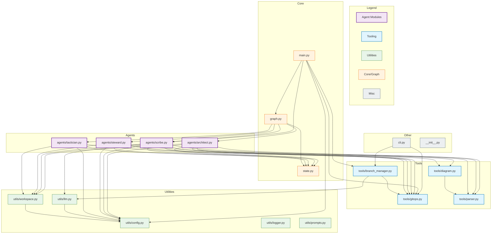

# RepoRanger Architecture Snapshot
_Generated: 2025-12-17 03:41:45_

## Dependency Graph

```mermaid
%% RepoRanger Dependency Graph
graph TD
    %% Styles
    classDef Agents fill:#f3e5f5,stroke:#6a1b9a,stroke-width:2px;
    classDef Tools fill:#e1f5fe,stroke:#0277bd,stroke-width:1.5px;
    classDef Utils fill:#e8f5e9,stroke:#2e7d32;
    classDef Core fill:#fff3e0,stroke:#ef6c00;
    classDef Other fill:#eceff1,stroke:#455a64;
    %% Legend
    subgraph Legend[Legend]
        LA[Agent Modules]:::Agents
        LT[Tooling]:::Tools
        LU[Utilities]:::Utils
        LC[Core/Graph]:::Core
        LO[Misc]:::Other
    end
    subgraph Other
        cli_py["cli.py"]:::Other
        src___init___py["__init__.py"]:::Other
    end
    subgraph Core
        main_py["main.py"]:::Core
        src_graph_py["graph.py"]:::Core
        src_state_py["state.py"]:::Core
    end
    subgraph Agents
        src_agents_architect_py["agents/architect.py"]:::Agents
        src_agents_scribe_py["agents/scribe.py"]:::Agents
        src_agents_steward_py["agents/steward.py"]:::Agents
        src_agents_tactician_py["agents/tactician.py"]:::Agents
    end
    subgraph Tools
        src_tools_branch_manager_py["tools/branch_manager.py"]:::Tools
        src_tools_diagram_py["tools/diagram.py"]:::Tools
        src_tools_gitops_py["tools/gitops.py"]:::Tools
        src_tools_parser_py["tools/parser.py"]:::Tools
    end
    subgraph Utilities
        src_utils_config_py["utils/config.py"]:::Utils
        src_utils_llm_py["utils/llm.py"]:::Utils
        src_utils_logger_py["utils/logger.py"]:::Utils
        src_utils_prompts_py["utils/prompts.py"]:::Utils
        src_utils_workspace_py["utils/workspace.py"]:::Utils
    end
    cli_py --> src_tools_branch_manager_py
    cli_py --> src_tools_gitops_py
    main_py --> src_agents_scribe_py
    main_py --> src_graph_py
    main_py --> src_tools_branch_manager_py
    main_py --> src_tools_gitops_py
    main_py --> src_utils_config_py
    src_agents_architect_py --> src_state_py
    src_agents_architect_py --> src_tools_diagram_py
    src_agents_architect_py --> src_tools_gitops_py
    src_agents_architect_py --> src_tools_parser_py
    src_agents_architect_py --> src_utils_config_py
    src_agents_architect_py --> src_utils_workspace_py
    src_agents_scribe_py --> src_state_py
    src_agents_scribe_py --> src_tools_diagram_py
    src_agents_scribe_py --> src_tools_gitops_py
    src_agents_scribe_py --> src_tools_parser_py
    src_agents_scribe_py --> src_utils_config_py
    src_agents_scribe_py --> src_utils_llm_py
    src_agents_scribe_py --> src_utils_workspace_py
    src_agents_steward_py --> src_state_py
    src_agents_steward_py --> src_tools_gitops_py
    src_agents_steward_py --> src_tools_parser_py
    src_agents_steward_py --> src_utils_config_py
    src_agents_steward_py --> src_utils_workspace_py
    src_agents_tactician_py --> src_state_py
    src_agents_tactician_py --> src_tools_gitops_py
    src_agents_tactician_py --> src_utils_config_py
    src_agents_tactician_py --> src_utils_workspace_py
    src_graph_py --> src_agents_architect_py
    src_graph_py --> src_agents_scribe_py
    src_graph_py --> src_agents_steward_py
    src_graph_py --> src_agents_tactician_py
    src_graph_py --> src_state_py
    src_tools_branch_manager_py --> src_tools_gitops_py
    src_tools_branch_manager_py --> src_utils_llm_py
    src_tools_diagram_py --> src_tools_parser_py
    src_utils_llm_py --> src_utils_config_py
    src_utils_workspace_py --> src_utils_config_py
```

## Complexity Heatmap

```mermaid
%% RepoRanger Complexity Heatmap
graph TD
    %% Styles
    classDef safe fill:#a5d6a7,stroke:#2e7d32;
    classDef warning fill:#fff59d,stroke:#fbc02d;
    classDef danger fill:#ef9a9a,stroke:#c62828;
    classDef missing fill:#eceff1,stroke:#90a4ae,stroke-dasharray:5 5;
    %% Legend
    subgraph Legend[Legend]
        LS[CC < 10]:::safe
        LW[10 <= CC < 20]:::warning
        LD[CC >= 20]:::danger
    end
    cli_py["cli.py (CC: 11)"]:::warning
    main_py["main.py (CC: 32)"]:::danger
    src___init___py["src/__init__.py (CC: 0)"]:::safe
    src_agents_architect_py["src/agents/architect.py (CC: 11)"]:::warning
    src_agents_scribe_py["src/agents/scribe.py (CC: 44)"]:::danger
    src_agents_steward_py["src/agents/steward.py (CC: 62)"]:::danger
    src_agents_tactician_py["src/agents/tactician.py (CC: 26)"]:::danger
    src_graph_py["src/graph.py (CC: 10)"]:::warning
    src_state_py["src/state.py (CC: 0)"]:::safe
    src_tools_branch_manager_py["src/tools/branch_manager.py (CC: 29)"]:::danger
    src_tools_diagram_py["src/tools/diagram.py (CC: 41)"]:::danger
    src_tools_gitops_py["src/tools/gitops.py (CC: 33)"]:::danger
    src_tools_parser_py["src/tools/parser.py (CC: 190)"]:::danger
    src_utils_config_py["src/utils/config.py (CC: 8)"]:::safe
    src_utils_llm_py["src/utils/llm.py (CC: 5)"]:::safe
    src_utils_logger_py["src/utils/logger.py (CC: 27)"]:::danger
    src_utils_prompts_py["src/utils/prompts.py (CC: 7)"]:::safe
    src_utils_workspace_py["src/utils/workspace.py (CC: 4)"]:::safe
```

> Tip: These Mermaid blocks are compatible with GitHub, Obsidian, and Notion.