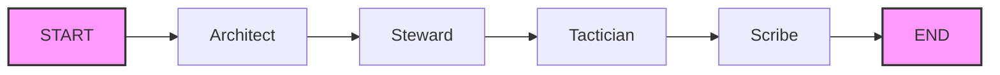

# RepoRanger

**Your Autonomous DevOps & Documentation Partner.**

RepoRanger is an agentic AI system built with **LangGraph**. It acts as a Senior Engineer that lives inside your repository and continuously handles documentation, code quality, git operations, and system visualization. See `docs/SYSTEM_DESIGN.md` for the master specification.

## 💡 Core Philosophy

RepoRanger is not a "chat with code" interface; it is an active maintainer focused on stopping Rot & Drift (docs diverging from code, architecture decay, and silent tech debt). It keeps context light through artifact-based memory and combines deterministic analysis with generative reasoning.

## 🗺️ System Vision

RepoRanger's architecture is designed for a linear, artifact-driven workflow. The core of the system is a LangGraph orchestrator that manages the state and flow between agents. Each agent performs a specific task, writing its results as artifacts to a shared workspace. This design ensures minimal context is passed to the LLMs, improving performance and reducing costs.



The diagram above illustrates the core workflow, from the initial architectural analysis to the final documentation updates.

## 🧱 Architecture Overview

| Layer            | Details                                                                                             |
|------------------|-----------------------------------------------------------------------------------------------------|
| Orchestrator     | LangGraph state machine with a shared clipboard (`RepoState`)                                        |
| Intelligence     | Gemini 1.5 Pro / GPT-4o for reasoning, Python `ast` module for metrics                              |
| Toolbelt         | PythonCodeParser (analysis), GitOps (safe git), MermaidGenerator (visuals)                           |
| Persistence      | Artifacts saved to `.reporanger_workspace` via `workspace.py`                                       |

The workflow is linear for v1: Architect → Steward → Tactician → Scribe → END. Each agent reads and writes artifacts to keep the LLM context tight.

## ✨ Key Features

*   **Automated Documentation:** Keeps documentation synchronized with code changes.
*   **Code Quality Audits:** Identifies potential issues and suggests refactoring.
*   **Dependency Visualization:** Generates diagrams for understanding project structure.
*   **Automated Refactoring:** Branches, stages, and commits refactor plans for review.
*   **Changelog Generation:** Automatically updates changelogs with meaningful narratives.

## 🧠 Agent Swarm

1. **Visual Architect (🏛️)** – Runs on PRs or scheduled audits. Builds dependency graphs and complexity heatmaps with Mermaid.js.
2. **Code Steward (🛡️)** – Audits only the changed Python files, computes AST metrics, detects dead code, and drafts refactors when thresholds are breached.
3. **Git Tactician (⚔️)** – Reacts to Steward artifacts by branching, staging refactor plans, and preparing safe commits for human review.
4. **Contextual Scribe (✍️)** – Reads diffs and artifacts to write PR narratives and update changelogs focusing on the "why" behind changes.

## 🛠️ Tooling

- **PythonCodeParser:** Deterministic AST parser that resolves imports, calculates cyclomatic complexity, nesting, impact graphs, and unused imports.
- **MermaidGenerator:** Converts parser output into dependency/class diagrams and complexity heatmaps (see `docs/DIAGRAMS.md` for usage).
- **GitOps:** GitPython wrapper that handles unborn HEAD repos, safe branching, diffs, and commits for the Tactician and Scribe.

## 📊 Workflow

```
START
  Architect   -> saves diagrams (.mmd artifacts)
  Steward     -> audits diffs, emits issue report + refactor plans
  Tactician   -> branches & commits refactor artifacts
  Scribe      -> drafts PR narratives & changelog updates
END
```

## 🩺 System Health & Quality Standard

*   **Recent Code Quality Findings:** Currently, no code quality issues have been detected. This indicates a healthy codebase. Regular audits are recommended to maintain this status. The Code Steward ensures that code adheres to defined complexity thresholds and identifies any instances of dead code, promoting maintainability and reducing technical debt.

## 🚀 Getting Started

### Prerequisites
* Python 3.10+
* Poetry (recommended) or Pip
* GitHub Personal Access Token (PAT)

### Installation

1.  **Clone the RepoRanger:**
    ```bash
    git clone [https://github.com/yourusername/reporanger.git](https://github.com/yourusername/reporanger.git)
    cd reporanger
    ```

2.  **Install Dependencies:**
    ```bash
    poetry install
    # OR
    pip install -r requirements.txt
    ```

3.  **Configure Environment:**
    ```bash
    cp .env.example .env
    # Add your OPENAI_API_KEY and GITHUB_ACCESS_TOKEN
    ```

4.  **Run the Agent:**
    ```bash
    python main.py
    ```

The run will execute the full LangGraph pipeline, printing each agent's progress and depositing artifacts into `.reporanger_workspace/`.

## 🤝 Contributing
Contributions are welcome! Please ensure that any PR includes updated tests.

## 📄 License
MIT